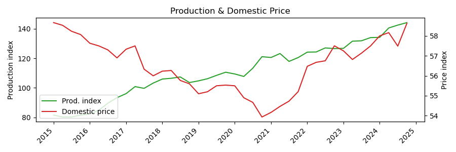
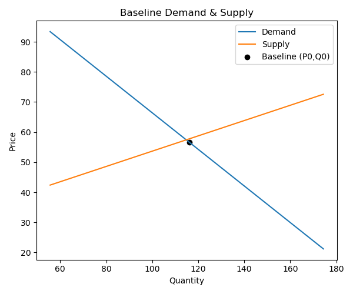
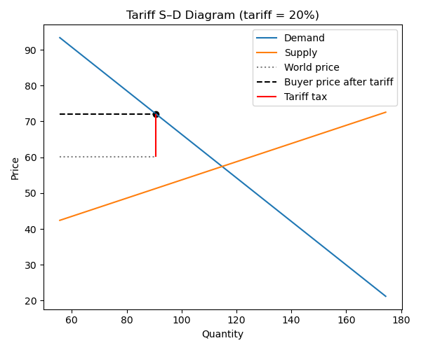
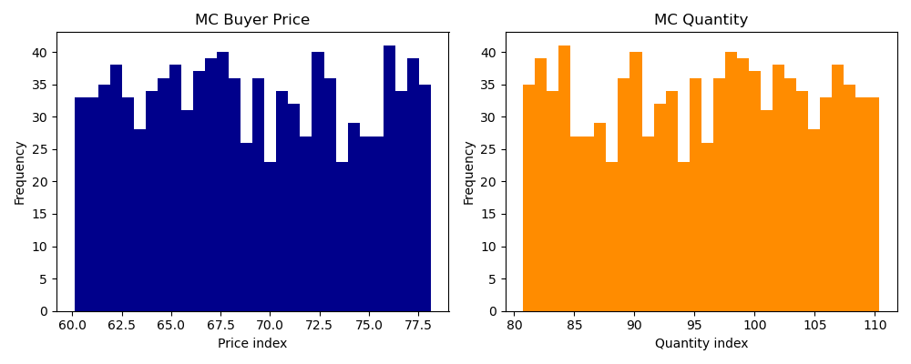

# Tariff-Impact-Simulation

## Introduction  
We trade because each country has a comparative advantage in producing certain goods. At the same time, governments impose tariffs to reduce dependency on foreign suppliers and to promote domestic industries. In 2025, the U.S. administration announced broad new tariffs and claimed they would both (1) raise \$6 trillion in revenue paid by foreign exporters and (2) revitalize American manufacturing, creating high-paying jobs. But mathematically only one of these can occur: generating \$6 trillion requires continued imports, whereas a manufacturing revival requires switching purchases to domestic producers. Which outcome prevails depends on factors like price elasticities, technological capacity, and global competitive responses.  

To explore these trade-offs, we build a simple microeconomic model that:  
1. Links tariffs to changes in demand, supply, import volumes, and prices.  
2. Simulates equilibrium before and after a tariff shock.  
3. Conducts a Monte Carlo sweep of tariff rates to show the distribution of outcomes.  

---

## Data Used  
- **Trade values by end-use category** (monthly, 1992–present):  
  - Download at [U.S. Census Historical FT Statistics](https://www.census.gov/foreign-trade/statistics/historical/index.html)  
  - Files: `NSAEXP.xlsx` (exports), `NSAIMP.xlsx` (imports) → manually converted to `quarterly_exports.csv` and `quarterly_imports.csv`  
  - Proxy: “Industrial supplies” category for semiconductors  
- **Domestic production volume** (2017 = 100):  
  - FRED series `IPG3344SQ` (semiconductors, NAICS 3344)  
  - FRED series `IPG333111SQ` (farm machinery, NAICS 333111)  
- **Domestic prices**:  
  - PPI for Semiconductor & Other Electronic Component Mfg (BLS NAICS 3344): FRED `PCU33443344`  
- **Import/export prices** (2000 = 100):  
  - Semiconductor export price: FRED `IQ21320`  
  - Semiconductor import price: FRED `IR21320`  

---

## Methodology  
## 1. Assemble Quarterly Dataset
- Collect U.S. import and export values, and convert them to real volumes using the world price index.
- Include the domestic production index (IP).
- Use price indices: Producer Price Index (PPI) for domestic prices, and import-price index for world prices.

## 2. Convert Nominal Trade Values to Real Volumes
- Compute real trade volume as:  
  `Volume = Value_in_USD / World_Price_Index`

## 3. Define Baseline Equilibrium (P0, Q0)
- Calculate the sample mean price and quantity over 2015–2024.
- These become the baseline:  
  `P0 = average_price`,  
  `Q0 = average_quantity`

## 4. Estimate Linear Demand and Supply Curves
- Assume constant price elasticities of demand (`e_d`) and supply (`e_s`).
- Demand curve:  
  - Slope: `B_d = (e_d * Q0) / P0`  
  - Intercept: `A_d = Q0 - B_d * P0`  
  - Linear form: `Q_d(P) = A_d + B_d * P`
- Supply curve:  
  - Slope: `B_s = (e_s * Q0) / P0`  
  - Intercept: `A_s = Q0 - B_s * P0`  
  - Linear form: `Q_s(P) = A_s + B_s * P`

## 5. Simulate Tariff Shock
- Hold world price constant: `P_w = mean_world_price`
- Buyer price with tariff: `P_b = P_w * (1 + t)`
- Compute new demand and supply at `P_b`:  
  - `Q_d(P_b)` from the demand curve  
  - `Q_s(P_b)` from the supply curve
- Trade gap: `Gap = Q_d(P_b) - Q_s(P_b)`

## 6. Monte Carlo Simulation
- Draw tariff rates randomly: `t ~ Uniform(0, 0.30)`
- For each draw, calculate corresponding `P_b`, `Q_d`, `Q_s`, and `Gap`
- Generate a distribution of trade gaps under different tariff scenarios.
---

## Current Production & Price Trends  
  
Over the past decade, U.S. semiconductor output (IPG3344SQ) surged—driven by private investment, AI-related capacity expansions, and government incentives (e.g., Micron’s new facility in Syracuse). Meanwhile, the domestic PPI for semiconductors (PCU33443344) has edged upward, reflecting rising producer (input) costs.

---

## Original Equilibrium  
  
At the 2015–24 means \((P_0, Q_0)\), the linear demand and supply curves intersect at the baseline equilibrium. 

---

## Tariff Simulation (20%)  
  
The simulation shows that a 20 percent tariff on imported semiconductors would drive the domestic buyer price from about 56 to roughly 72 on our index, while demand falls only modestly (around 22 percent) and, under the assumption of very flexible domestic production, output jumps by over 50 percent. Because supply expands far more than demand contracts, the U.S. switches from importing the equivalent of five index-points of chips to exporting about 82. In this scenario, most of the tariff burden (about 71 percent) falls on buyers, with producers covering the rest. However, these results depend on strong assumptions, particularly a high supply elasticity of 2 that likely overstates how quickly costly semicondcutors industrues can actually expand or how they can source the raw materials needed, a partial-equilibrium framework that ignores world-price adjustments or retaliation, and elasticity values drawn from the literature rather than estimated from real trade data. According to the [USITC working paper on U.S. exposure to the Taiwanese semiconductor industry (2023)](https://www.usitc.gov/publications/332/working_papers/us_exposure_to_the_taiwanese_semiconductor_industry_11-21-2023_508.pdf#:~:text=Price%20elasticity%20of%20supply%2C%20U,00%20Estimated%20using%20capacity%20utilization), the estimated price elasticity of supply for US is approximately 2 (p. 11). Based on the same report, demand elasticity is often described as greater than 1; therefore, for  modeling, elasticity of 0.8 is chosen.
In practice, more realistic supply constraints and market responses would probably mean continued, if reduced, imports and a larger share of the tariff falling on producers. 

---

## Monte Carlo Results  
  
In our Monte Carlo analysis, we ran 1,000 simulations with a tariff randomly chosen between 0 % and 30 %. The first chart shows that buyer prices rise smoothly from just above 60 (no tariff) to the high 70s (30 % tariff), reflecting the equal chance of every tariff level. The second chart demonstrates that demand only declines modestly—from about 110 to the low 80s on a 2017 = 100 scale—even under steep tariffs, indicating that short-term chip demand is relatively inelastic. Together, these results show that raising tariffs primarily increases prices, while quantities fall only slightly. With our assumption of highly responsive domestic production, local suppliers can easily meet the reduced demand, and imports drop to zero once the tariff exceeds roughly 10 %.

---

## Assumptions & Limitations  
- **Proxy data**: “Industrial supplies” includes non-semiconductor goods; PPI may diverge from transaction prices; import-price index embeds U.S. transport and tariff effects rather than pure world costs.  
- **Linear curves**: Real demand and supply often curve—elasticities vary at different price levels. Our straight-line approximation may misstate large shocks.   
- **Imposed elasticities**: Taken from literature, not estimated from our data.

---

## Future Work  
1. Replace proxies data with more closer data using instrument variable.  
2. Estimate non-linear demand and supply (e.g., log–log regressions).  

